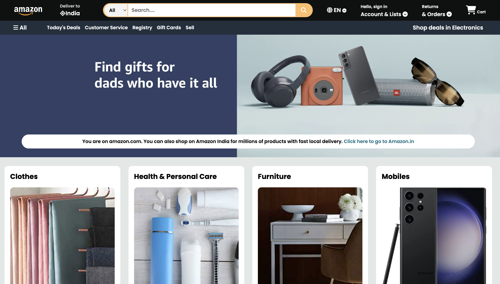

# 🛒 Amazon Clone (HTML & CSS)

This is a simple **Amazon Clone** created using **only HTML and CSS**.  
It replicates the **UI design** of the Amazon homepage, focusing on layout, colors, and basic responsiveness — without any backend or JavaScript functionality.

---

## 📸 Preview
 <!-- Replace with actual screenshot path -->

---

## ✨ Features
- ✅ Fully responsive Amazon-style homepage
- ✅ Navigation bar with search box
- ✅ Product categories and deals section
- ✅ Footer similar to Amazon’s
- ✅ Clean, reusable CSS styling

---

## 📂 Project Structure
amazon-clone/
│── index.html # Main HTML file
│── style.css # Main CSS file
│── images/ # Folder for images (logos, products, banners)
└── README.md # Project documentation
